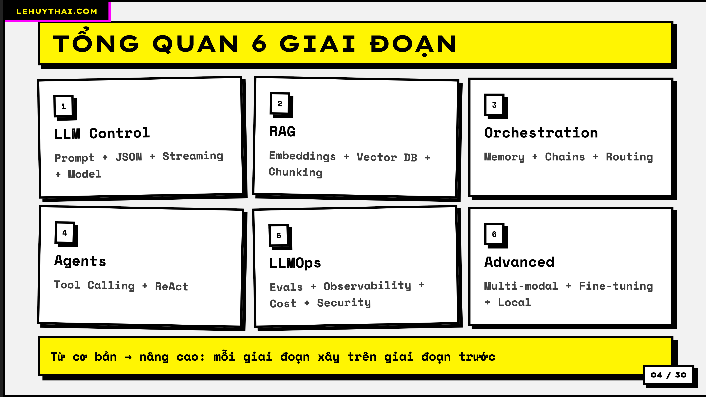
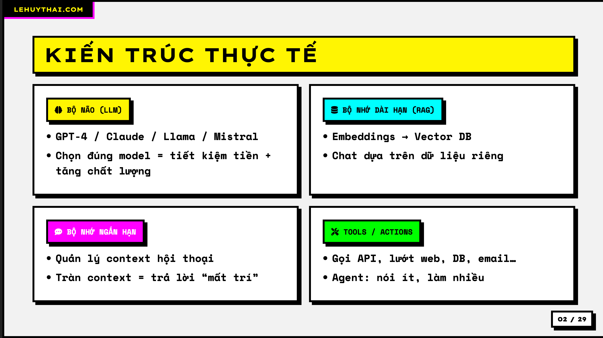
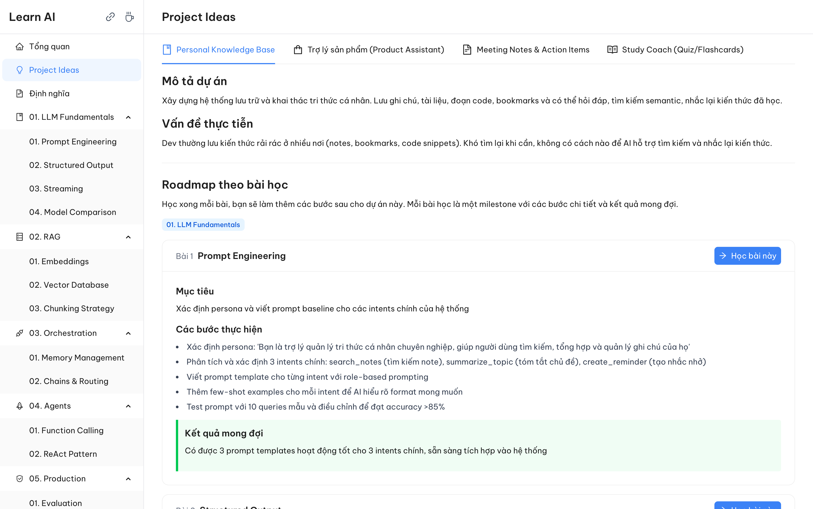
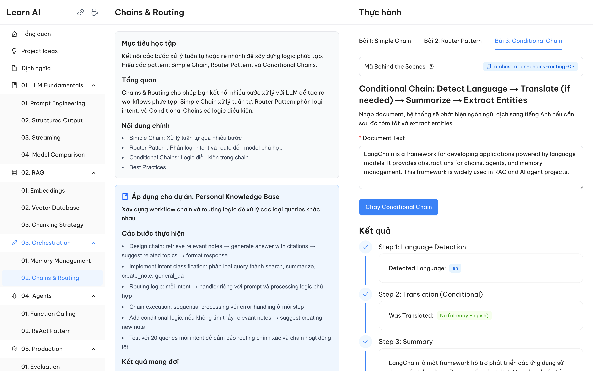
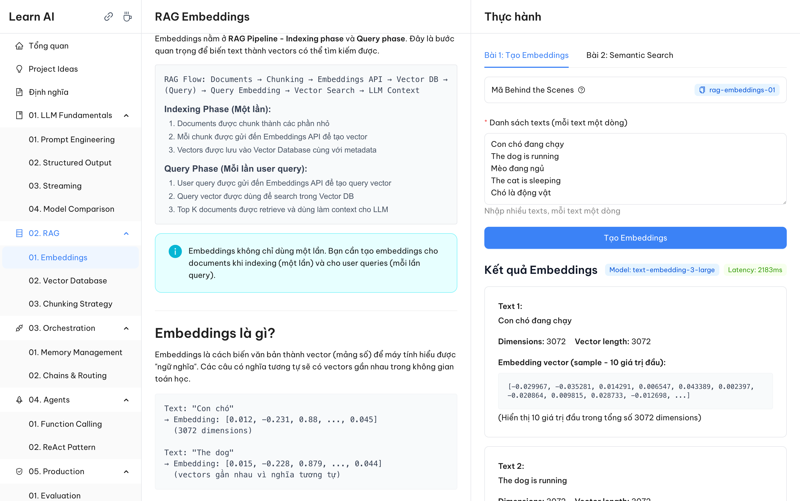
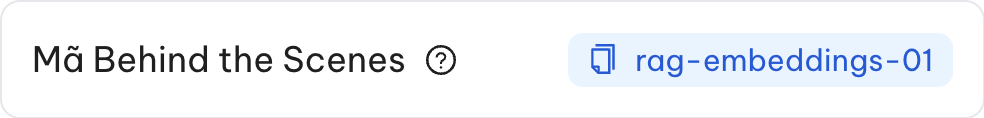

# Lộ trình học AI Application Engineer

Chia sẻ với anh em lộ trình tutorial học **AI Application Engineer** ở đây nhé ạ. Đây sẽ là một lộ trình cực chi tiết, dễ học, dễ thực hành bao gồm nhiều khối kiến thức tuần tự, đi kèm slide bài giảng, tài liệu docs chi tiết, source code bài học (FE/BE) có lý thuyết và các Demo thực hành kèm các project ideas có guideline chi tiết theo từng bài học để vừa học vừa xây dựng 1 sản phẩm giải quyết vấn đề thực tế nhé ạ.

## Giới thiệu

Chào anh em, chuyện là thời gian gần đây mình có cày cuốc về **AI Application Engineer**. Ngắn gọn thì AI Application Engineer là những người xây dựng các sản phẩm web, app, … có tích hợp AI (để phân biệt với kiểu Machine Learning Engineer thiên về train model, Data Engineer thiên về data sạch, …). Thì cơ hội việc làm liên quan tới vị trí này là cực lớn.

Mình xây dựng lộ trình tutorial này để học từ lý thuyết tới thực hành, ý tưởng sẽ là:

1. Biết bức tranh tổng thể có gì
2. Các thành phần nằm ở đâu, làm việc với nhau như thế nào
3. Học lý thuyết các thành phần
4. Tạo Demo thực tế cho các thành phần
5. Song song build 1 cái Side Project mà sẽ update mỗi khi biết thêm kiến thức

## Sẽ có **6 giai đoạn lớn** cùng 18 chủ đề bao gồm:

1. **LLM Fundamentals**: Prompt + JSON + Streaming + Model
2. **RAG**: Embeddings + Vector DB + Chunking
3. **Orchestration**: Memory + Chains + Routing
4. **Agents**: Tool Calling + ReAct
5. **Production**: Evals + Observability + Cost + Security
6. **Advanced**: Multi-modal + Fine-tuning + Local



## Cách sử dụng bộ tài liệu

Vậy làm sao để bắt đầu với bộ tài liệu, source code của mình, thì mình sẽ gửi các bạn 1 link git repo (ở comment của post), sau khi kéo code này về mình nghĩ sẽ có **4 level tận dụng**:

1. **Sử dụng Slide roadmap** để hiểu tổng quan bức tranh
2. **Sử dụng bộ tài liệu Markdown** để hiểu chi tiết hơn mỗi giai đoạn lớn
3. **Chạy bộ source code** để học lý thuyết kèm sử dụng các Demo thực hành
4. **Hướng dẫn cách đọc source code** (chỉ đọc phần quan trọng)

> **Mục tiêu tối thượng**: Phải có cái nhìn tổng thể, hiểu các phần là gì làm gì, tận dụng để Build được 1 cái dự án thực tế có tận dụng hết các kiến thức đã học.

## Project Ideas

Mình chia sẻ các ý tưởng làm dự án để học, bao gồm:

- **Personal Knowledge Base**: Xây dựng hệ thống lưu trữ và khai thác tri thức cá nhân. Lưu ghi chú, tài liệu, đoạn code, bookmarks và có thể hỏi đáp, tìm kiếm semantic, nhắc lại kiến thức đã học.
- **Trợ lý sản phẩm**: Chatbot hỗ trợ khách hàng tìm kiếm sản phẩm, đọc thông tin chi tiết, so sánh, và đặt hàng. Sử dụng product catalog và FAQs làm knowledge base.
- **Meeting Notes & Action Items**: Hệ thống tự động xử lý meeting notes/transcripts: tóm tắt, trích xuất action items, assign tasks, tạo agenda cho follow-up meetings.
- **Study Coach**: Tạo quiz và flashcards tự động từ tài liệu học tập. Chấm điểm, theo dõi tiến độ, gợi ý bài cần ôn lại dựa trên spaced repetition.

Không chỉ đơn giản là ý tưởng mà sẽ có guideline từng bước làm sao áp dụng kiến thức được học để xây dựng sản phẩm ý tưởng đó. Các bạn có thể tham khảo, chọn ra 1 ý tưởng để xây dựng trong quá trình học để hiểu hơn nhé ạ.

> **Lưu ý**: Bộ lộ trình tutorial này dành cho anh em đã có ít nhất 1 chút kiến thức về lập trình (web app thì càng tốt nhé ạ). Ngoài ra đây là các kiến thức cho người mới, các bạn sẽ không thấy kiến thức quá cao siêu trong tutorial này.

---

## I. Sử dụng Slide roadmap để hiểu tổng quan bức tranh

Các bạn có thể tìm thấy Slide này ở [`/docs/slide/slide.html`](./docs/slide/slide.html) → Mở lên nhé ạ. Trong này sẽ có tổng quan về lộ trình học, biết các thành phần, mỗi thành phần có những keywords gì.



Sẽ có **6 giai đoạn lớn** bao gồm:

1. **LLM Fundamentals**
2. **RAG** (Retrieval-Augmented Generation)
3. **Orchestration**
4. **Agents**
5. **Production**
6. **Advanced**

> **Nếu dừng lại ở bước này**: Có thể tham khảo roadmap, nếu thấy hợp lý có thể tự research về các keyword, tự học và build.

---

## II. Sử dụng bộ tài liệu Markdown để hiểu chi tiết hơn mỗi giai đoạn lớn

> **Note**: Nếu xác định sẽ chạy source code lên thì có thể bỏ qua bước này nhé ạ. Còn nếu chỉ muốn tham khảo các kiến thức chi tiết hơn để tự học và build side project để học.

Các bạn sẽ thấy các thư mục ở [`/docs`](./docs). Hãy bắt đầu với [`00-overview`](./docs/00-overview) trước, đây là bản tổng quát xem cần học gì, làm gì (đây sẽ là bản detail hơn 1 chút của Slide). Sau đó hãy để ý tới các thư mục có số phía trước khác, mỗi thư mục sẽ là 1 giai đoạn, bên trong sẽ có các khối kiến thức cần học trong giai đoạn đó:

- [`01-llm-fundamentals`](./docs/01-llm-fundamentals) - LLM Fundamentals
- [`02-rag`](./docs/02-rag) - RAG (Retrieval-Augmented Generation)
- [`03-orchestration`](./docs/03-orchestration) - Orchestration
- [`04-agents`](./docs/04-agents) - Agents
- [`05-production`](./docs/05-production) - Production
- [`06-advanced`](./docs/06-advanced) - Advanced

Ngoài ra có 1 thư mục tên là [`project-ideas`](./docs/project-ideas), đây sẽ là một số gợi ý về ý tưởng side projects để mọi người tham khảo. Các ideas này sẽ cho biết rằng ở mỗi giai đoạn của roadmap bạn có thể làm gì để update dự án → Học song song với hành. Kết quả cuối cùng sẽ là một dự án chứa đựng đa số các kiến thức cần học.

---

## III. Chạy bộ source code để học lý thuyết kèm sử dụng các Demo thực hành

### Tại sao nên chạy source code?

Câu hỏi là tại sao nên chạy source code này, thì đây là thứ chi tiết và nhiều kiến thức nhất mà mình đã làm. Nó chuyển hoá các docs, roadmap bên trên thành như bài học chi tiết, biết được các kiến thức là gì, để làm gì, nằm ở đâu trong một dự án, best practice là gì. Ngoài ra còn có phần thực hành, ví dụ chạy thật để test ngay khi học. Có những thứ khó hiểu, khó tưởng tượng nhưng chỉ cần test thực tế thử 1 cái là được.

Khi xây dựng bộ source code này, mình đã tránh sử dụng quá nhiều thư viện đã đóng gói, vì đây là giai đoạn học, mình muốn chúng ta hiểu bản chất nên dự án sẽ được viết khá raw thay vì dùng các thư viện đã đóng gói. Khi làm dự án side project các bạn có thể research và sử dụng các thư viện đã được đóng gói để giảm tải khối lượng code, tăng tốc độ xây dựng nhé ạ.

### 1. Chạy dự án

Bộ source code của mình bao gồm **Frontend** và **Backend**, cả 2 để dùng Javascript stack (NextJs/NestJs). Mình tin rằng nếu bạn nào từng chạy 1 dự án Frontend nhưng React, Vue, Angular, Next, … đều có thể chạy được bộ source code này.

#### Yêu cầu chuẩn bị

Các bạn sẽ cần chuẩn bị trước (Mình sẽ đặt các link cần thiết ở bình luận):

- **NodeJs**: Cần cài đặt NodeJs, mình nghĩ đa số mọi người đã có sẵn cái này rồi.
  - [Tải về tại đây](https://nodejs.org/en/download)
- **OpenRouter API Key**:
  - Đây là gì? Bản chất nó như OpenAI key thôi, nhưng openrouter như 1 cái wrapper endpoint vậy, nó cung cấp rất nhiều loại model (OpenAI, Gemini, Deepseek, …).
  - Vì vậy nếu chúng ta cần test nhiều model thì sẽ rất ngon, không bị giới hạn chỉ ở trong OpenAI model.
  - Nạp khoảng vài đô vào để học nhé ạ (học phí duy nhất ở đây).
  - Nếu không config cái này thì vẫn học được lý thuyết nhưng sẽ không thể dùng các bài thực hành nhé ạ. Mà sớm muộn gì cũng cần API key thôi ae.
  - [Đăng ký tại đây](https://openrouter.ai/)
- **TryChroma Database Config**:
  - Đây là gì? Database vector để lưu trữ, truy xuất dữ liệu dạng vector nhưng lưu trên cloud.
  - Nếu bạn đã từng nghe tới Mongo Atlas thì nó cũng kiểu như vậy.
  - Có bản free là test thoải mái.
  - Nếu không có cái này sẽ không sử dụng được các bài thực hành về RAG (giai đoạn 2) nhé ạ.
  - [Đăng ký tại đây](https://www.trychroma.com/lethai2597)

#### Cấu hình

Oke, sau khi đã có đủ rồi thì các bạn tạo file `.env` dựa theo `.env.example` ở [`/backend`](./backend) ra rồi thay các giá trị bên trên vào nhé.

#### Khởi chạy

Sau đó chạy như 1 dự án NodeJs bình thường thôi, mở 2 cái terminal ra (trong npm, yarn, pnpm dùng gì thì chọn cái đó nhé ạ, thay vào lệnh của mình):

**Phía Frontend:**

```bash
# Vào thư mục
cd frontend

# Cài phụ thuộc
pnpm i

# Chạy dự án
pnpm dev
```

**Phía Backend:**

```bash
# Vào thư mục
cd backend

# Cài phụ thuộc
pnpm i

# Chạy dự án
pnpm start:dev
```

**Truy cập:**

- Frontend: http://localhost:3000
- API Docs: http://localhost:4000/api-docs

### 2. Khai thác như thế nào

Khi chạy lên bạn thấy giao diện UI khá dễ hiểu và có thể mày mò thử. Các bạn có thể chú ý theo thứ tự như sau:

1. **Trang tổng quan**: Đọc hết trang này để biết cần học những gì (có thể có những phần khó hiểu nhưng cứ bình tĩnh ạ, vì đây chỉ là overview)

2. **Project Ideas**: Có 4 ý tưởng dự án tham khảo bạn có thể đọc và chọn 1 cái mà mình cảm thấy thú vị, đây đều là các ý tưởng thực tế. Bên dưới sẽ có roadmap dành riêng cho ý tưởng đó, có thể khó hiểu nhưng đừng vội, ở mỗi bài học sẽ hiển thị lại những việc bạn cần làm để xây dựng ý tưởng này.



3. **Các giai đoạn và bài học**: Lần lượt học từng bài bao gồm: Lý thuyết, Thực hành, Xây dựng sản phẩm





4. **Thuật ngữ**: Tổng hợp các thuật ngữ mà bạn có thể tra cứu khi thấy khó hiểu

---

## IV. Hướng dẫn cách đọc source code cho các thực hành Demo

Có thể sau khi đọc lý thuyết và dùng thực hành Demo bạn vẫn khó hình dung là code cụ thể như thế nào. Thì mở mỗi Demo mình sẽ có 1 phần tên là **"Mã Behind the Scenes"**, bạn hãy click Copy cái mã này và tìm ở source code sẽ tìm thấy hàm thực thi Demo đó.



Hàm thực thi sẽ có comment đầy đủ rõ ràng, ít dùng thư viện và không tách thành quá nhiều file để có thể dễ theo dõi. Nhưng comment có prefix là **`BUSINESS`** thì bạn nên quan tâm vì đây là luồng chính của chức năng, còn các comment có prefix là **`FRONTEND`** thì có thể bỏ qua, đây là các logic support cho việc hiển thị phía Frontend.

---

## Tổng kết và Disclaimer

Nếu các bạn đã đọc đến đây thì mình thật sự rất xúc động vì đây là một bài dài. Dự án này mình làm để học cá nhân và chia sẻ cộng đồng nên nó sẽ hoàn toàn **MIỄN PHÍ**. Nhưng có thể sẽ có lúc có lỗi, đây là điều khó tránh khỏi, nếu gặp vấn đề gì thì hãy để lại cho mình một bình luận nhé.

Nếu các bạn hứng thú với việc chia sẻ như thế này của mình thì đừng quên để lại cho mình 1 react, 1 comment nhé ạ. Hoặc các bạn có thể mua cho mình 1 cốc cafe thì mình sẽ rất cảm động (mất hơn 3 tuần để hoàn thành cái này ạ :xx), tại tài khoản ngân hàng:

**Vietinbank - Lê Huy Thái - 0961741678**

<div style="margin-bottom: 1rem;">
  
</div>

Bài viết đã rất dài mình sẽ kết thúc tại đây, chúc các bạn học tập vui vẻ và có 1 năm 2026 thành công rực rỡ nhé ạ.
